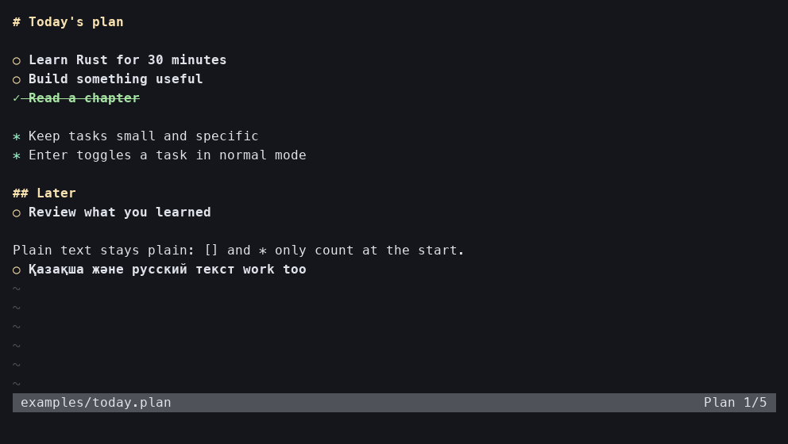

# plan.nvim

A Rust-backed Neovim plugin for plain-text `.plan` files.
Write tasks with `[]` and pointers with `*` at the beginning of a line.
Press Enter in normal mode to mark a task complete.



```text
# Today

[] Learn Rust
[] Ship something useful
[x] Read a chapter
* Keep the next step small
```

Markers are recognized only at column one.
An indented marker or a marker in the middle of a sentence stays ordinary text.
`[ ]` is also accepted as an unfinished task, and `[X]` as a completed task.

## Completion style

Pending tasks show a gold `○`.
Completed tasks show `✓` with green, bold, struck-through text and a dark green background when selected.
A newly completed task alternates `✦` and `✧` every 150 milliseconds for 900 milliseconds, matching the accomplishment effect in term-todos.
The effect also runs when you change `[]` to `[x]` manually.
The saved file always contains your text and checkbox syntax; display symbols and animation never modify it.
Insert mode reveals the literal marker so you can edit it.

## Install with lazy.nvim

Requires Neovim 0.10 or newer and Rust/Cargo for building from source.
Put this specification in your plugins configuration:

```lua
return {
  {
    "Sal-sal-sal/plan.nvim",
    ft = "plan",
    build = "cargo build --release --locked --target-dir target",
    init = function()
      vim.filetype.add({ extension = { plan = "plan" } })
    end,
    opts = {},
  },
}
```

Then run `:Lazy sync`, open `today.plan`, and use `:checkhealth plan`.
If you need to rebuild the engine, run `:PlanBuild`.

For another plugin manager, build with the same Cargo command and call `require("plan").setup()`.
The plugin is loaded from Neovim's runtime path.

### Use a release binary

Download the matching archive from [Releases](https://github.com/Sal-sal-sal/plan.nvim/releases).
Extract `plan-nvim`, make it executable, and set `opts.binary` to its absolute path.
Rust/Cargo is optional when using a compiled binary.
The Neovim Lua files must still be installed with your plugin manager.
Linux release binaries are built on Ubuntu 24.04; build from source on older distributions.

## Keys and commands

All editing keys and commands are local to `.plan` buffers.

| Key / command | Action |
| --- | --- |
| Enter in normal mode / `:PlanToggle` | Toggle `[]` and `[x]` |
| Enter in insert mode | Continue a task or pointer on the next line |
| Enter on an empty list item in insert mode | Leave the list |
| `]t` / `:PlanNext` | Go to the next pending task |
| `[t` / `:PlanPrev` | Go to the previous pending task |
| `<leader>pt` | Toggle the current task |
| `<leader>ps` / `:PlanStats` | Show completion counts and percentage |
| `:PlanBuild` | Build the Rust engine |

On ordinary text, normal-mode Enter keeps its usual next-line behavior.
Undo, redo, manual checkbox editing, Unicode, and normal file saving work as expected.
Headings use `# ` through `###### `.

## Options

```lua
require("plan").setup({
  mappings = true,
  icons = true,
  animation = true,
  debounce = 100,
  -- binary = "/absolute/path/to/plan-nvim",
})
```

Set `icons = false` to display the literal checkboxes.
Set `animation = false` for reduced motion.
Set `mappings = false` to define your own keys and use the commands.
Highlight groups are `PlanTodo`, `PlanTodoText`, `PlanDone`, `PlanDoneText`, `PlanDoneFocus`, `PlanPointer`, and `PlanHeading`.
Override them through `vim.api.nvim_set_hl()`.

For a statusline component, use `require("plan").status()`.
The latest statistics are available in `vim.b.plan_stats`.
The `User PlanUpdated` event includes the affected buffer in `event.data.buf`.

## Development

Rust owns syntax recognition, task transformations, continuation rules, and statistics.
Lua owns Neovim integration, async rendering, and the completion effect.
The engine reads one JSON request per line from stdin and writes one response per line to stdout.
Requests are passed directly to the executable without invoking a shell.

```bash
python3 scripts/verify.py
```

Verification includes Rust tests and Clippy plus real Neovim editing, persistence, Unicode, undo/redo, animation, and lifecycle workflows.
GitHub Actions checks the minimum supported Neovim version and current Neovim on Linux and macOS.
To regenerate the demo, run `python3 scripts/tui_smoke.py` followed by `python3 scripts/render_demo.py` with Pillow installed.

Licensed under MIT.
